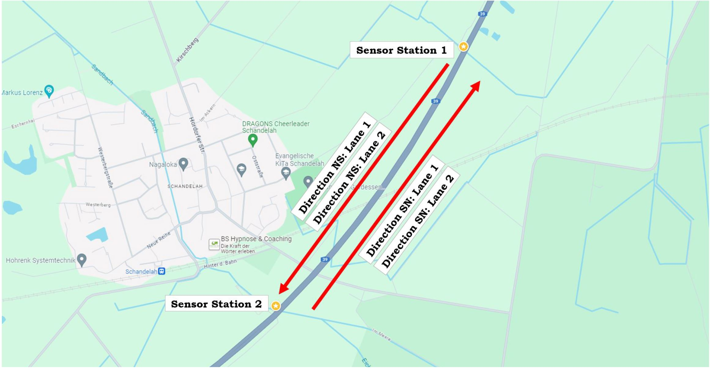
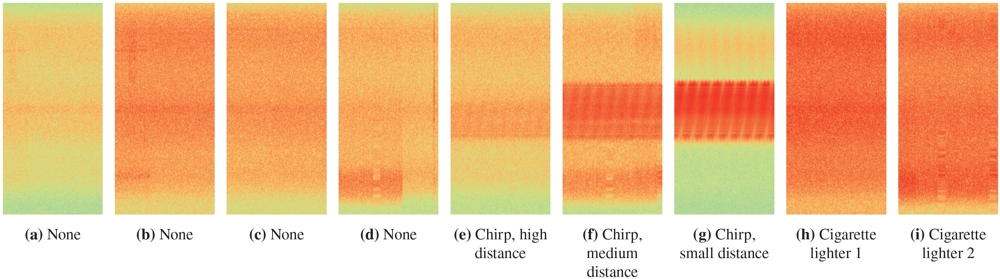
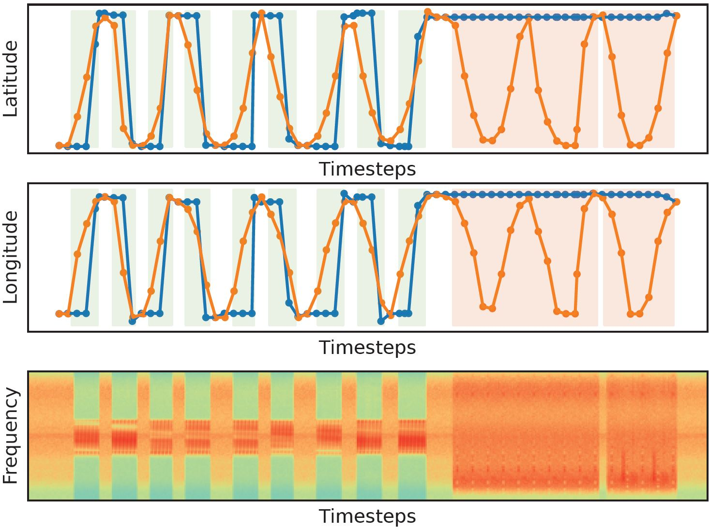

# Spectrum Highway Dataset 2 for Interference Classification in GNSS Data

Latest update: 2024-10-30

Project size: 30 GB


## Introduction

We publish the *Spectrum Highway Dataset 2* that was recorded close to a German highway and contains a variety of interference classes in GNSS signals from spectral hardware. For the dataset recording, we developed a hardware setup that captures short, wideband snapshots in both E1 and E6 GNSS bands. This setup is mounted to a bridge over a highway. We place two sensor stations with a distance of 1km next to a highway. The setup records 20ms raw IQ snapshots triggered from the energy with a sample rate of 62.5MHz, an analog bandwidth of 50MHz and an 8bit bit-width. See the following visualization of the highway lanes of the real-world highway dataset 2. The car with integrated jammers drove from north to south and from south to north, each with two lanes (Map of Schandelah near Braunschweig, Germany, GoogleMaps, August 2024):



## Dataset

The folder *data* contains the *Spectrum Highway Dataset 2* with the corresponding labels in *.txt* files for the train-test split. One sample in the text file is defined as for example:

`data/157369.npy 0`

The following figure shows exemplary snapshots of the spectrogram. The dataset contains nine classes.



The following figure visualizes the influence of interferences on the latitutde (top) and longitude (middle) of a smartphone. The jammer and smartphone is integrated in the vehicle. The orange line shows the vehicle reference position. The blue line is the smartphone position. The green (handheld jammer) and red (cigarette lighter) marked backgrounds are the interfered timesteps.



For our spectrum highway dataset 1 recorded along a different highway bridge, see the following website: https://gitlab.cc-asp.fraunhofer.de/darcy_gnss/FIOT_highway 

For our dataset recorded in a controlled environment with a high-frequency antenna, see the following website: https://gitlab.cc-asp.fraunhofer.de/darcy_gnss/FIOT_LC_laboratory

For our dataset recorded in a controlled environment with a low-frequency antenna, see the following website: https://gitlab.cc-asp.fraunhofer.de/darcy_gnss/controlled_low_frequency


## References

For more information of the dataset and results, see our publication. If you use our dataset for your research, please consider citing:

```
@inproceedings{heublein_raichur_ion,
  author = {Lucas Heublein and Nisha L. Raichur and Tobias Feigl and Tobias Brieger and Fin Heuer and Lennart Asbach and Alexander Rügamer and Felix Ott},
  title = {{Evaluation of (Un-)Supervised Machine Learning Methods for GNSS Interference Classification with Real-World Data Discrepancies}},
  booktitle = {\href{https://www.ion.org/publications/abstract.cfm?articleID=19887}{Proc. of the Intl. Technical Meeting of the Satellite Division of the Institute of Navigation (ION GNSS+)}},
  pages = {1260--1293},
  month = sep,
  year = 2024,
  address = {Baltimore, MD},
  doi = {10.33012/2024.19887}
}
```

```
@inproceedings{ott_heublein_icl,
  author = {Felix Ott and Lucas Heublein and Nisha Lakshmana Raichur and Tobias Feigl and Jonathan Hansen and Alexander Rügamer and Christopher Mutschler},
  title = {{Few-Shot Learning with Uncertainty-based Quadruplet Selection for Interference Classification in GNSS Data}},
  booktitle = {\href{https://ieeexplore.ieee.org/document/10578525}{IEEE Intl. Conf. on Localization and GNSS (ICL-GNSS)}},
  month = jun,
  year = {2024},
  address = {Antwerp, Belgium},
  doi = {10.1109/ICL-GNSS60721.2024.10578525}
}
```

## Acknowledgment

This work has been carried out within the DARCII project, funding code 50NA2401, supported by the German Federal Ministry for Economic Affairs and Climate Action (BMWK), managed by the German Space Agency at DLR and assisted by the Bundesnetzagentur (BNetzA) and the Federal Agency for Cartography and Geodesy (BKG). Additionally, this work was supported by the Bavarian Ministry of Economic Affairs, Regional Development and Energy through the Center for Analytics – Data – Applications (ADA-Center) within the framework of „BAYERN DIGITAL II“ (20-3410-2-9-8).

## License

This work is licensed under a CC BY-NC-SA 4.0: Creative Commons Attribution-Noncommercial-ShareAlike, see [https://creativecommons.org/licenses/by-nc-sa/4.0/]()

## Kontakt

If you have any questions or tips to improve the datasets, contact us:

Felix Ott: [felix.ott@iis.fraunhofer.de]()

Lucas Heublein: [lucas.heublein@iis.fraunhofer.de]()

Nordostpark 84, 90411 Nürnberg, Germany, [GoogleMaps](https://www.google.de/maps/place/Fraunhofer-Institut+f%C3%BCr+Integrierte+Schaltungen+IIS,+Standort+N%C3%BCrnberg/@49.486235,11.1276616,17z/data=!4m13!1m7!3m6!1s0x47a1fd54eca9e61f:0xa0f77e8f8bf3c17d!2sNordostpark+84,+90411+N%C3%BCrnberg!3b1!8m2!3d49.4860832!4d11.1290145!3m4!1s0x47a1fd548f392167:0xbf6afa9178ff23d9!8m2!3d49.4861809!4d11.1286658)

Fraunhofer Institute for Integrated Circuits IIS, Nürnberg, Germany
